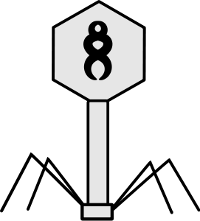

# Phage

Phage is a private, decentralized platform for writing, sharing and selling software. Having a safe haven for software development is incredibly important, as Freedom of Speech and Expression are coming more and more under the attack of large corporate and government enterprises.

Phage takes advantage of Freenet in darknet mode to provide a self-sufficient application backbone. You need only to connect with friends using phage to speak to connect to the whole phage community - this also helps to protect your identity.

## Concept

1) User receives phage from a friend. They install and exchange keys with a friend. To help achieve better connectivity, a friend will automatically ask to introduce their new friend with their current friends - user may decide to accept or reject friendship.

2) Phage daemon started. 

3) Users access a list of available malware with associated hashes. Files may be inserted already or not. If the file cannot be found in the network, it can be requested and re-inserted by the next person who has that specific sample. Should there be a reward system for keeping the data around? Look into possibilities.

4) Forum-style system that allows discussion and file sharing. 

5) Transactions?

Users publish a list of:
- Files
- Code
- Documentation
- Discussion
- Transactions

Work on the functionality first, GUI second. 

## TODO:

1) Figure out how to autoconfigure Freenet with a bash script. 
2) Create a GUI that allows fast key exchange
3) Get review from opperhiem, other people that aren't douchebags.
